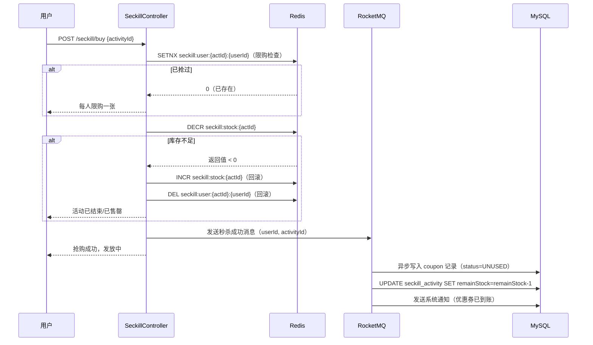

## 用户需求

实现优惠券秒杀功能：用户花 5 元购买一张面值 8 元的优惠券，活动限量发放（秒杀），需要处理高并发抢购场景下的超卖问题，并支持优惠券在下单时抵扣使用。

## 产品概述

在现有 VIP 购买体系基础上，新增"秒杀优惠券"模块。用户可在活动期间以 5 元抢购面值 8 元的优惠券，购买后优惠券记录在账户中，下单购买月卡 VIP 时可使用该优惠券抵扣 8 元（即原价 9.9 元 → 使用券后 1.9 元）。

## 核心功能

- **秒杀活动管理**：管理员创建秒杀活动（设置优惠券总库存、活动时间、券面值/售价）
- **秒杀抢购接口**：用户在活动期间下单购买优惠券，Redis 预扣减库存防超卖，RocketMQ 异步落库
- **优惠券钱包**：用户可查询自己账户下的优惠券列表及状态（未使用/已使用/已过期）
- **下单抵扣**：购买 VIP 时支持传入优惠券 ID，抵扣后以差价创建订单
- **幂等防重**：同一用户同一活动限购一张，Redis 原子操作保证并发安全

## 技术栈

- **框架**：Spring Boot 2.7.6 + MyBatis-Plus 3.5.9（沿用现有）
- **缓存/原子操作**：Redis（已接入）—— 使用 `DECR` 原子预扣库存 + `SETNX` 用户限购去重
- **消息队列**：RocketMQ（已接入，参考 FeedMQProducer 模式）—— 异步处理优惠券落库，削峰填谷
- **持久化**：MySQL + MyBatis-Plus（雪花 ID，逻辑删除，驼峰字段名与列名一致）

---

## 实现方案

### 整体思路：Redis 预扣 + RocketMQ 异步落库（两阶段提交）

秒杀高并发核心矛盾是库存超卖与数据库压力。方案采用：

1. **Redis 原子预扣库存**：活动开始前将库存加载到 Redis（`seckill:stock:{activityId}`），用户请求到达时执行 `DECR`，结果 < 0 则立即拒绝（无需访问数据库），避免超卖。
2. **Redis 限购去重**：用 `SETNX seckill:user:{activityId}:{userId} 1` 原子判断该用户是否已参与，防止同一用户抢多张。
3. **RocketMQ 异步落库**：预扣成功后发送 MQ 消息，Consumer 异步写入 `coupon` 表，同时扣减数据库库存（`stock = stock - 1 WHERE stock > 0`），业务结果通过 `sys_notice` 通知用户。
4. **超时未落库补偿**：Consumer 消费失败时 RocketMQ 自动重试，最终一致性保证。

### 关键设计决策

- **不使用 Lua 脚本**：Redis DECR 本身是原子的，配合 SETNX 两步操作用简单逻辑实现，降低复杂度。活动初始化时用 `SET seckill:stock:{id} {count}` 写入。
- **库存数据库双写**：`seckill_activity` 表保存剩余库存，Consumer 成功写券后 `UPDATE seckill_activity SET remainStock = remainStock - 1`，保证数据库最终一致。
- **优惠券使用集成 OrderService**：在现有 `createOrder()` 入口增加 `couponId` 可选参数，校验优惠券有效性并原子锁定（UPDATE 乐观锁），订单 `mockPay()` 时标记优惠券为已使用。
- **ProductTypeEnum 不扩展**：优惠券本质是折扣凭证而非商品，新增 `coupon` 表独立管理，不混入 ProductType 枚举。

### 性能考量

- Redis 预扣为 O(1) 操作，单次秒杀请求在 Redis 层即可返回，数据库压力集中于 MQ Consumer 的顺序消费。
- 活动库存初始化使用 Spring `@EventListener(ApplicationReadyEvent)` 或 管理员接口触发，避免重启后 Redis 数据丢失问题（`seckill:stock` key 设置有效期与活动结束时间一致）。

---

## 架构设计



---

## 目录结构

```
src/main/java/com/axin/picturebackend/
├── config/
│   └── SeckillRocketMQConfig.java          # [NEW] 秒杀 MQ Topic/Tag/ConsumerGroup 常量，参考 FeedRocketMQConfig 模式
├── constant/
│   └── RedisConstant.java                  # [MODIFY] 追加秒杀相关 Redis Key 常量：seckill:stock:、seckill:user:
├── controller/
│   ├── SeckillController.java              # [NEW] 秒杀接口：用户抢券 POST /seckill/buy、活动列表查询 GET /seckill/list
│   └── CouponController.java               # [NEW] 优惠券接口：我的优惠券列表 GET /coupon/my、使用情况查询
├── mapper/
│   ├── SeckillActivityMapper.java          # [NEW] extends BaseMapper<SeckillActivity>
│   └── CouponMapper.java                   # [NEW] extends BaseMapper<Coupon>
├── model/
│   ├── entity/
│   │   ├── SeckillActivity.java            # [NEW] 秒杀活动实体（id雪花、name、totalStock、remainStock、faceValue、salePrice、startTime、endTime、isDelete）
│   │   └── Coupon.java                     # [NEW] 用户优惠券实体（id雪花、userId、activityId、couponNo、faceValue、status=UNUSED/USED/EXPIRED、isDelete）
│   ├── Enum/
│   │   └── CouponStatusEnum.java           # [NEW] 优惠券状态枚举：UNUSED/USED/EXPIRED，含 text/value/getEnumByValue，参考 OrderStatusEnum
│   ├── dto/
│   │   └── seckill/
│   │       └── SeckillBuyRequest.java      # [NEW] 秒杀购买请求：activityId(Long)
│   └── vo/
│       ├── SeckillActivityVO.java          # [NEW] 活动视图：id、name、faceValue、salePrice、remainStock、startTime、endTime、状态描述
│       └── CouponVO.java                   # [NEW] 优惠券视图：id、couponNo、faceValue、status、statusName、activityName、createTime
├── service/
│   ├── SeckillService.java                 # [NEW] 秒杀 Service 接口：buyCoupon()、listActiveActivities()、initStockToRedis()
│   ├── CouponService.java                  # [NEW] 优惠券 Service 接口：listMyCoupons()、useCoupon()（供 OrderService 调用）、getValidCoupon()
│   └── impl/
│       ├── SeckillServiceImpl.java         # [NEW] 秒杀核心实现：Redis 预扣库存+限购+MQ投递；参考 OrderServiceImpl 的事务和日志风格
│       └── CouponServiceImpl.java          # [NEW] 优惠券管理：查询我的券列表、校验并锁定优惠券（乐观锁 UPDATE）
├── manager/
│   └── seckill/
│       ├── SeckillMQProducer.java          # [NEW] 秒杀 MQ 生产者，参考 FeedMQProducer：syncSend，失败 warn 日志
│       ├── SeckillMQConsumer.java          # [NEW] 秒杀 MQ 消费者：写 coupon 表、扣数据库库存、发系统通知
│       └── SeckillMQMessage.java           # [NEW] 秒杀 MQ 消息体：userId、activityId、couponNo、timestamp
└── OrderService.java / OrderServiceImpl    # [MODIFY] createOrder() 增加可选 couponId 参数，支持优惠券抵扣计算实际金额；mockPay() 中标记优惠券 USED

SQL/
└── seckill_coupon.sql                      # [NEW] 建表：seckill_activity + coupon 两张表 DDL
```

---

## 关键代码结构

### Redis Key 常量（追加到 RedisConstant）

```java
// 秒杀活动剩余库存（String，value=剩余数量）
public static final String SECKILL_STOCK = "seckill:stock:";

// 用户参与秒杀记录（String，NX写入，有效期=活动结束时间）
// Key: seckill:user:{activityId}:{userId}
public static final String SECKILL_USER = "seckill:user:";
```

### SeckillMQMessage 消息体

```java
@Data
public class SeckillMQMessage implements Serializable {
    private Long userId;
    private Long activityId;
    private String couponNo;      // 预生成的券编号
    private BigDecimal faceValue; // 券面值
    private long timestamp;
}
```

### OrderService 接口扩展（新增重载）

```java
// 原有方法保持不变，新增支持优惠券的重载
OrderVO createOrder(Long userId, String productType, Long couponId);
```

## Agent Extensions

### SubAgent

- **code-explorer**
- Purpose: 在实现各模块时按需探索现有代码（如 FeedMQConsumer 的消费模式、SysNoticeService 的 sendNotice 签名）确保代码风格一致
- Expected outcome: 所有新增代码与现有项目保持一致的注解风格、日志规范和事务处理模式