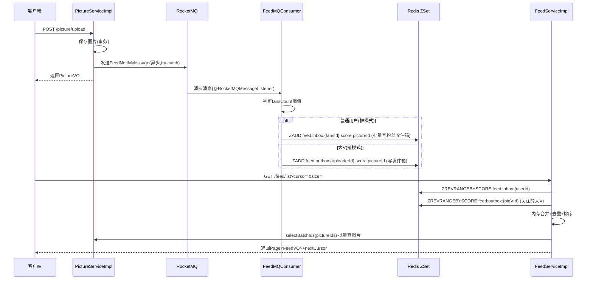

## 用户需求

当用户上传图片时，系统需要自动给其所有粉丝发送消息通知，粉丝可以查看自己的消息动态（Feed流）。需要针对"粉丝少的普通用户"和"粉丝多的大V用户"两种场景设计不同的分发策略，采用企业级架构应对高并发。

## 产品概述

基于现有图片社区后端，新增 **图片上传 Feed 流通知** 功能：

- 用户上传图片后，系统异步将动态推送给关注者
- 粉丝端可通过 Feed 流接口（游标翻页）查看关注者的最新上传动态
- 针对大V（粉丝数超过阈值）采用拉模式避免写扩散，普通用户采用推模式

## 核心功能

- **推模式（普通用户）**：上传成功后异步发送 MQ 消息，消费者批量写入粉丝 Redis 收件箱（ZSet）
- **拉模式（大V）**：仅写发件箱（ZSet），粉丝拉取 Feed 时主动合并关注的大V发件箱
- **推拉合并查询**：Feed 流查询时合并用户收件箱 + 所关注大V发件箱，按时间倒序、游标分页返回
- **通知枚举扩展**：`NoticeTypeEnum` 新增 `PICTURE_UPLOAD` 类型，`SysNotice` 新增 `type` 字段
- **粉丝数缓存**：Redis 缓存粉丝数，判断大V阈值时不查库
- **Feed 条目展示**：返回图片缩略图、标题、作者信息、上传时间等

## 技术栈选型

| 层级 | 技术 | 说明 |
| --- | --- | --- |
| 异步解耦 | RocketMQ（rocketmq-spring-boot-starter） | 项目当前无MQ，引入RocketMQ解耦上传与通知写扩散，支持顺序消息、事务消息，吞吐量更高 |
| Feed 存储 | Redis ZSet | 收件箱/发件箱均用 ZSet，score=时间戳，天然有序 |
| ORM | MyBatis-Plus（已有） | 复用现有 Mapper 体系 |
| 框架 | Spring Boot（已有） | 复用全套基础设施 |


---

## 实现方案

### 核心策略：推拉结合（Push-Pull Hybrid Feed）

**阈值判断**：粉丝数 `≥ 1000` 视为大V（常量可配置），粉丝数从 Redis 缓存读取（`user:fans:count:{userId}`），避免每次查库。

**推模式（普通用户，粉丝数 < 1000）**：

1. 上传成功后，主线程向 RocketMQ 投递消息（pictureId, uploaderId, createTime）
2. MQ 消费者查询该用户全量粉丝 ID 列表
3. 批量写入每个粉丝的 Redis 收件箱：`ZADD feed:inbox:{fansId} createTime pictureId`
4. 每个收件箱只保留最新 500 条（`ZREMRANGEBYRANK`）防止内存膨胀

**拉模式（大V，粉丝数 ≥ 1000）**：

1. 上传成功后，只写大V自己的发件箱：`ZADD feed:outbox:{uploaderId} createTime pictureId`
2. 发件箱保留最新 1000 条
3. 粉丝查询 Feed 时，系统读取其关注的大V列表，合并各大V发件箱

**Feed 查询（合并推拉）**：

1. 读取用户收件箱（ZSet 游标分页）
2. 读取该用户关注的所有大V发件箱（按 score 范围截取）
3. 内存中合并、去重、按 score 倒序排列，返回游标分页结果
4. 批量查询 Picture 详情（IN 查询，防止 N+1），组装 FeedVO

### 时间复杂度分析

- 推送阶段（消费者）：O(fans_count) — 仅普通用户触发，大V跳过
- 拉取阶段（合并）：O(K × page_size) — K 为关注的大V数量，通常 ≤ 100

### MQ 可靠性

- 生产者端：消息投递失败记录日志，**不影响主流程**（try-catch 降级）
- 消费者端：幂等处理（Redis ZSet 天然幂等，重复 ZADD 只更新 score）；RocketMQ 消费失败自动重试（默认16次），最终失败进死信队列
- Topic 配置：持久化 Topic + Tag 过滤（Tag: `FEED_NOTIFY`）

---

## 实现注意事项

1. **不破坏上传主流程**：MQ 发送必须在 `transactionTemplate.execute()` 之外，且 try-catch 捕获异常，上传失败不影响图片保存
2. **粉丝数缓存一致性**：`doFollow()` 成功后自增/自减 Redis 粉丝计数器，避免查库
3. **大V阈值常量化**：定义在 `FeedConstant` 中，默认 1000，后续可调整
4. **N+1 防护**：Feed 查询中图片详情用 `selectBatchIds()` 批量查，用户信息同理
5. **游标分页**：使用时间戳作为游标（`minScore`/`maxScore`），避免传统页码翻页时数据错位
6. **现有通知体系兼容**：`SysNotice` 新增 `type` 字段为可选（ALTER TABLE ADD COLUMN），不影响已有通知查询逻辑
7. **收件箱容量控制**：每次 ZADD 后执行 `ZREMRANGEBYRANK key 0 -501`，保留最新500条
8. **UserFollowMapper 扩展**：新增 `selectFansIdList(Long userId)` 自定义 SQL，返回粉丝 ID 列表（批量处理，分批次 1000 条一批避免 OOM）

---

## 架构设计



---

## 目录结构

```
src/main/java/com/axin/picturebackend/
├── constant/
│   ├── RedisConstant.java                   [MODIFY] 新增 FEED_INBOX/FEED_OUTBOX/USER_FANS_COUNT 三个key前缀
│   └── FeedConstant.java                    [NEW] 大V阈值(BIG_V_THRESHOLD=1000)、收件箱容量(INBOX_MAX=500)等常量
│
├── model/
│   ├── entity/
│   │   └── SysNotice.java                   [MODIFY] 新增 type 字段（Integer，通知类型）
│   ├── Enum/
│   │   └── NoticeTypeEnum.java              [MODIFY] 新增 PICTURE_UPLOAD("图片上传通知","picture_upload") 枚举值
│   ├── dto/
│   │   └── feed/
│   │       └── FeedQueryRequest.java        [NEW] Feed游标分页请求DTO：cursor(Long时间戳游标)、size(每页数量)
│   └── vo/
│       └── FeedVO.java                      [NEW] Feed条目VO：pictureId、thumbnailUrl、picName、authorId、authorName、authorAvatar、createTime
│
├── manager/
│   └── feed/
│       ├── FeedMQMessage.java               [NEW] MQ消息体：pictureId、uploaderId、uploaderName、createTime（时间戳）、fansCount
│       ├── FeedMQProducer.java              [NEW] RocketMQ消息发送，使用RocketMQTemplate.syncSend()，失败只打warn日志
│       └── FeedMQConsumer.java              [NEW] @RocketMQMessageListener消费消息，推/拉分支判断，批量ZADD写Redis，分批处理大粉丝量
│
├── config/
│   └── FeedRocketMQConfig.java              [NEW] 声明 RocketMQ Topic 常量（FEED_NOTIFY_TOPIC、FEED_NOTIFY_TAG），提供Bean或常量类
│
├── mapper/
│   └── UserFollowMapper.java                [MODIFY] 新增 selectFansIdList(@Param userId) 自定义SQL方法
│
├── service/
│   ├── FeedService.java                     [NEW] 接口：getFeedList(FeedQueryRequest, User) 返回游标分页结果
│   └── impl/
│       └── FeedServiceImpl.java             [NEW] 核心实现：合并收件箱+大V发件箱、游标分页、批量查图片、组装FeedVO；注入UserFollowService获取关注大V列表
│
├── controller/
│   └── FeedController.java                  [NEW] GET /feed/list，需登录，调用FeedService
│
└── service/impl/
    └── PictureServiceImpl.java              [MODIFY] uploadPicture()新增图片成功后，在事务外 try-catch 发送 FeedMQProducer 消息

src/main/resources/
└── application.yml                          [MODIFY] 新增 rocketmq 连接配置（name-server、producer.group）

pom.xml                                      [MODIFY] 新增 rocketmq-spring-boot-starter 依赖（org.apache.rocketmq，版本2.3.x）

SQL/
└── feed_notify.sql                          [NEW] ALTER TABLE sys_notice ADD COLUMN type INT DEFAULT NULL; 及索引

src/main/resources/mapper/
└── UserFollowMapper.xml                     [NEW/MODIFY] 新增 selectFansIdList SQL：SELECT userId FROM user_follow WHERE followUserId=#{userId}
```

### 关键接口定义

```java
// FeedService.java
public interface FeedService {
    // 返回值包含 records(List<FeedVO>) 和 nextCursor(Long，null表示无更多)
    FeedPageResult getFeedList(FeedQueryRequest request, User loginUser);
}

// FeedQueryRequest.java
@Data
public class FeedQueryRequest implements Serializable {
    private Long cursor;   // 时间戳游标，首次传null，后续传上次响应的nextCursor
    private Integer size = 20; // 每页数量，最大50
}

// FeedVO.java
@Data
public class FeedVO implements Serializable {
    private Long pictureId;
    private String thumbnailUrl;
    private String picName;
    private Long authorId;
    private String authorName;
    private String authorAvatar;
    private Long createTime; // 时间戳，同时作为游标值
}

// FeedMQMessage.java
@Data
public class FeedMQMessage implements Serializable {
    private Long pictureId;
    private Long uploaderId;
    private String uploaderName;
    private Long createTime;  // 时间戳，用作ZSet score
    private Long fansCount;   // 发送时快照，消费者直接用于阈值判断
}
```