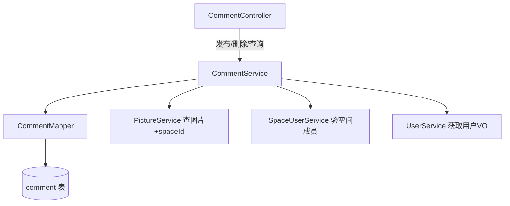

## 用户需求

用户希望在现有图片后端系统中增加评论功能，允许用户对图片发表评论，并支持嵌套回复。

## 产品概述

为图片后端系统添加一套完整的评论模块，涵盖评论的发布、查询和删除功能，并实现无限层级嵌套回复（邻接表结构）。评论需遵循现有的权限体系：空间内图片只有空间成员可以评论，公开图片（spaceId 为 null）任何登录用户均可评论。

## 核心功能

- **发布评论**：登录用户可以对指定图片发表评论；支持在已有评论下发表回复（通过 parentId 指定父评论），支持无限层级嵌套
- **删除评论**：评论作者本人或管理员可以删除评论；删除父评论时级联删除所有子评论
- **查询评论**：按图片 ID 分页查询评论列表，返回树形结构（一级评论 + 所有子孙评论）；响应中附带发布者的基础用户信息（头像、昵称等）
- **权限控制**：公开图片（spaceId = null）所有登录用户可评论；私有/团队空间图片只有对应空间成员可评论，非成员拒绝操作

## 技术栈

与现有项目保持一致：

- Spring Boot 2.7.6 + Java 1.8
- MyBatis Plus 3.5.9（ORM + 分页）
- MySQL（存储评论数据）
- Sa-Token（权限认证，复用现有空间权限体系）
- Lombok + Hutool + 雪花算法 ID

---

## 实现思路

### 整体策略

采用**邻接表**数据结构存储评论，`parent_id = 0` 表示一级评论，非 0 表示回复某条评论。查询时先按 `pictureId` 分页查出所有评论（含所有层级），在 Service 层用 Java 代码递归组装成树形结构返回给前端，避免数据库递归查询（MySQL 8 CTE 或应用层均可，Java 组装兼容 MySQL 5.7 且性能可控）。

### 关键技术决策

1. **邻接表 vs 闭包表**：选择邻接表。闭包表查询快但写入复杂、维护成本高；邻接表结构简单，对中小量评论（单张图片几百到几千条）应用层组装树形耗时极低，完全满足需求，且与项目现有代码风格一致。
2. **树形组装在 Service 层完成**：一次查出该图片全部评论，内存中 `Map<Long, CommentVO>` 辅助按 parentId 挂载子节点，O(n) 完成，无 N+1 问题。
3. **权限复用**：在 Service 层通过 `PictureService.getById` 获取图片的 `spaceId`，再复用已有的 `SpaceUserAuthManager` 或直接查 `SpaceUserService` 判断用户是否为空间成员，不引入新权限体系。
4. **评论数计数**：在 `picture` 表不新增字段（保持现有表稳定），评论数由前端调用查询接口获取总条数，后续如需可扩展。

---

## 实现细节注意事项

- **循环引用防护**：添加评论时校验 `parentId` 指向的评论必须属于同一张图片，防止跨图片挂载。
- **级联删除**：删除评论时，使用递归查询所有子评论 ID，批量逻辑删除（`isDelete = 1`），保持与现有逻辑删除风格一致。
- **分页策略**：只对**一级评论（parent_id = 0）**分页，每页返回 N 条一级评论，同时加载其所有子孙回复（或按需懒加载）。为保持接口简单，默认一次返回一级评论 + 子评论的完整树，前端自行渲染。
- **VO 用户信息组装**：复用 `UserService.getUserVO()` 填充评论者信息，不暴露密码等敏感字段。
- **@Lazy 注解**：如 Service 间存在循环依赖，参照现有 `PictureLikeServiceImpl` 使用 `@Lazy` 解决。

---

## 架构设计



---

## 目录结构

```
src/main/java/com/axin/picturebackend/
├── model/
│   ├── entity/
│   │   └── Comment.java                       # [NEW] 评论实体类，对应 comment 表，包含 id/pictureId/userId/parentId/content/isDelete/createTime 等字段，使用雪花算法 ID + @TableLogic 逻辑删除
│   ├── dto/
│   │   └── comment/
│   │       ├── CommentAddRequest.java          # [NEW] 发布评论请求 DTO，包含 pictureId、parentId（默认0，表示一级评论）、content 字段
│   │       └── CommentQueryRequest.java        # [NEW] 查询评论请求 DTO，继承 PageRequest，包含 pictureId 字段
│   └── vo/
│       └── CommentVO.java                     # [NEW] 评论响应 VO，包含 id/pictureId/parentId/content/createTime/userVO（发布者信息）/children（子评论列表，递归）字段
├── mapper/
│   └── CommentMapper.java                     # [NEW] 评论 Mapper，继承 BaseMapper<Comment>，扩展按 pictureId 批量查询方法（支持未删除过滤）
├── service/
│   ├── CommentService.java                    # [NEW] 评论 Service 接口，继承 IService<Comment>，声明 addComment/deleteComment/listCommentTree 方法
│   └── impl/
│       └── CommentServiceImpl.java            # [NEW] 评论 Service 实现，包含权限校验（公开图片 vs 空间图片）、邻接表树形组装（内存递归）、级联删除逻辑
├── controller/
│   └── CommentController.java                 # [NEW] 评论 Controller，挂载路径 /comment，提供 POST /add（发布）、POST /delete（删除）、POST /list（查询树形列表）三个接口
└── SQL/
    └── create_tables.sql                      # [MODIFY] 追加 comment 表的 DDL 语句
```

---

## 关键数据结构

### comment 表 DDL

```sql
CREATE TABLE IF NOT EXISTS `comment` (
    `id`         BIGINT       NOT NULL COMMENT '评论ID（雪花算法）',
    `picture_id` BIGINT       NOT NULL COMMENT '所属图片ID',
    `user_id`    BIGINT       NOT NULL COMMENT '评论者用户ID',
    `parent_id`  BIGINT       NOT NULL DEFAULT 0 COMMENT '父评论ID，0表示一级评论',
    `content`    VARCHAR(1000) NOT NULL COMMENT '评论内容',
    `create_time` DATETIME    NOT NULL DEFAULT CURRENT_TIMESTAMP COMMENT '创建时间',
    `update_time` DATETIME    NOT NULL DEFAULT CURRENT_TIMESTAMP ON UPDATE CURRENT_TIMESTAMP COMMENT '更新时间',
    `is_delete`  TINYINT      NOT NULL DEFAULT 0 COMMENT '逻辑删除：0-正常 1-已删除',
    PRIMARY KEY (`id`),
    INDEX `idx_picture_id` (`picture_id`),
    INDEX `idx_user_id` (`user_id`),
    INDEX `idx_parent_id` (`parent_id`)
) ENGINE=InnoDB DEFAULT CHARSET=utf8mb4 COMMENT='图片评论表';
```

### CommentVO 核心结构

```java
public class CommentVO implements Serializable {
    private Long id;
    private Long pictureId;
    private Long parentId;
    private String content;
    private Date createTime;
    private UserVO user;                   // 发布者信息（复用 UserVO）
    private List<CommentVO> children;      // 子评论（递归，内存组装）
}
```