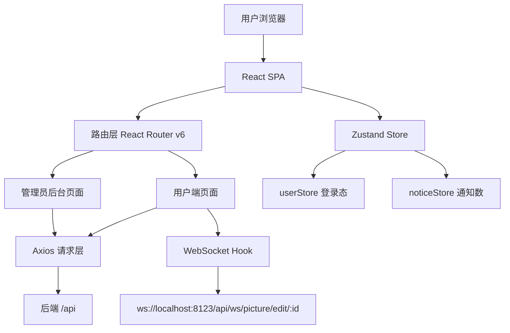

## 用户需求

根据后端项目 `structure.md` 文件，在 `d:/java/java_1/picture/picture-frontend` 目录下从零搭建配套前端项目。

## 产品概述

一个图片分享与管理平台的前端应用，面向普通用户提供图片浏览、上传、空间管理、协同编辑等功能；面向管理员提供用户管理、图片审核、空间管理等后台功能。

## 核心功能

### 普通用户端

- **认证模块**：注册、登录、注销、个人信息编辑
- **公共图库**：瀑布流浏览图片，按标签/分类/关键词搜索，查看图片详情（含评论、点赞）
- **个人空间**：私有空间管理，上传图片（文件/URL方式），图片编辑（裁剪/旋转/缩放）
- **团队空间**：创建/加入团队空间，成员管理（admin可添加/编辑/删除成员），按角色权限控制操作
- **协同编辑**：基于 WebSocket 的多人实时图片编辑（缩放/旋转/翻转），显示当前编辑者
- **系统通知**：通知列表、未读数角标、标记已读
- **评论系统**：图片详情页树形评论，支持一级评论与回复

### 管理员后台

- **用户管理**：分页查询、删除用户
- **图片管理**：分页查询所有图片、审核（通过/拒绝）、编辑、删除；批量爬取上传
- **空间管理**：分页查询所有空间、更新空间配置（配额级别）、删除空间
- **数据面板**：展示平台统计数据（图片总数、用户总数、空间总数等）

## 技术栈

| 类别 | 技术选型 |
| --- | --- |
| 框架 | React 18 + TypeScript |
| 构建工具 | Vite 5 |
| UI 组件库 | Ant Design 5.x |
| 路由 | React Router v6 |
| 状态管理 | Zustand（轻量级，适合中型项目） |
| HTTP 请求 | Axios（统一封装拦截器） |
| WebSocket | 原生 WebSocket API + 自定义 Hook |
| 图片预览/编辑 | Fabric.js（Canvas 协同编辑） |
| 瀑布流 | react-masonry-css |
| 样式 | CSS Modules + Ant Design Token 定制 |


## 实现策略

采用**单页应用（SPA）+ 路由守卫**架构：

- 通过 React Router v6 的 `<Outlet>` 机制实现嵌套路由，公共布局（Header/Sider）复用
- 路由守卫基于 Zustand 存储的登录用户状态，区分「未登录跳转登录页」「非 admin 跳转 403」
- Axios 统一封装，自动处理 `/api` baseURL、Cookie 携带（`withCredentials`）、响应解包（BaseResponse）、401/403 全局重定向
- 空间权限通过查询 `/api/spaceUser/get/my` 获取当前用户在空间中的权限列表，前端按权限动态显示操作按钮
- WebSocket 封装为自定义 Hook `usePictureEdit`，管理连接/重连/消息发送/消息接收，协同编辑界面使用 Fabric.js Canvas 渲染

## 实现注意事项

- **Cookie 跨域**：后端已配置 CorsConfig，前端 Axios 需设置 `withCredentials: true`，Vite dev server 需配置 proxy 避免跨域问题
- **Long 类型精度**：后端 `JsonConfig.java` 已将 Long 序列化为 String，前端 id 字段均用 `string` 类型接收
- **图片上传**：文件上传使用 `FormData`，Ant Design Upload 组件需自定义 `customRequest`；URL 上传单独调用接口
- **分页统一**：所有分页列表接口返回 `{ records, total, current, size }`，封装公共分页 Hook
- **权限控制**：路由层用守卫组件拦截，页面内用 `usePermission` Hook 判断按钮级权限
- **WebSocket 重连**：协同编辑连接断开时自动重试 3 次，超时后提示用户
- **防抖搜索**：图片列表搜索框 300ms 防抖，避免频繁请求

## 架构设计



## 目录结构

```
picture-frontend/
├── public/
│   └── favicon.ico
├── index.html
├── vite.config.ts                        # [NEW] Vite 配置，含 proxy 转发 /api 到 8123，路径别名 @
├── tsconfig.json                         # [NEW] TypeScript 配置
├── package.json                          # [NEW] 依赖声明
└── src/
    ├── main.tsx                          # [NEW] 应用入口，挂载 React
    ├── App.tsx                           # [NEW] 根组件，路由注册入口
    ├── types/                            # [NEW] 全局 TypeScript 类型定义
    │   ├── user.ts                       # [NEW] UserVO、LoginUserVO、注册/登录请求类型
    │   ├── picture.ts                    # [NEW] PictureVO、上传/编辑/查询请求类型、PictureTagCategory
    │   ├── space.ts                      # [NEW] SpaceVO、SpaceUserVO、创建/编辑请求类型、SpaceLevel
    │   ├── comment.ts                    # [NEW] CommentVO、发布/查询请求类型
    │   ├── notice.ts                     # [NEW] NoticeVO、查询/标记已读请求类型
    │   └── common.ts                     # [NEW] BaseResponse、PageRequest、PageResult、DeleteRequest 通用类型
    ├── api/                              # [NEW] 接口请求封装层
    │   ├── request.ts                    # [NEW] Axios 实例，baseURL=/api，withCredentials，响应拦截器（解包/401跳转）
    │   ├── user.ts                       # [NEW] 用户模块所有接口
    │   ├── picture.ts                    # [NEW] 图片模块所有接口
    │   ├── space.ts                      # [NEW] 空间模块所有接口
    │   ├── spaceUser.ts                  # [NEW] 空间成员模块所有接口
    │   ├── comment.ts                    # [NEW] 评论模块所有接口
    │   └── notice.ts                     # [NEW] 系统通知模块所有接口
    ├── store/                            # [NEW] Zustand 状态管理
    │   ├── userStore.ts                  # [NEW] 登录用户状态（loginUser、setLoginUser、logout）
    │   └── noticeStore.ts                # [NEW] 未读通知数（unreadCount、fetchUnreadCount）
    ├── hooks/                            # [NEW] 自定义 React Hooks
    │   ├── usePictureEdit.ts             # [NEW] WebSocket 协同编辑 Hook（连接管理/消息收发/重连）
    │   ├── usePermission.ts              # [NEW] 空间权限 Hook（查询当前用户在指定空间的权限列表）
    │   └── usePagination.ts             # [NEW] 公共分页 Hook（current/pageSize/total/onChange）
    ├── components/                       # [NEW] 公共可复用组件
    │   ├── GlobalHeader/                 # [NEW] 全局顶部导航（Logo、菜单、通知角标、用户头像下拉）
    │   ├── PictureCard/                  # [NEW] 图片卡片（缩略图/名称/点赞数/操作按钮，权限控制）
    │   ├── PictureUploadModal/           # [NEW] 图片上传弹窗（文件上传 + URL上传 Tab 切换）
    │   ├── PictureEditModal/             # [NEW] 图片信息编辑弹窗（名称/标签/分类）
    │   ├── CommentSection/               # [NEW] 评论区组件（树形评论列表 + 发布框）
    │   ├── SpaceLevelTag/                # [NEW] 空间级别标签（普通版/专业版/旗舰版）
    │   └── AuthGuard/                    # [NEW] 路由守卫组件（未登录/无权限拦截）
    ├── layouts/                          # [NEW] 页面布局
    │   ├── UserLayout/                   # [NEW] 用户端布局（GlobalHeader + 内容区）
    │   └── AdminLayout/                  # [NEW] 管理员布局（左侧 Sider 菜单 + 内容区）
    ├── pages/                            # [NEW] 页面组件
    │   ├── auth/
    │   │   ├── LoginPage.tsx             # [NEW] 登录页（账号密码表单，登录成功后跳转首页）
    │   │   └── RegisterPage.tsx          # [NEW] 注册页（账号密码确认密码表单）
    │   ├── home/
    │   │   └── HomePage.tsx              # [NEW] 公共图库首页（瀑布流图片列表，标签/分类/关键词筛选）
    │   ├── picture/
    │   │   └── PictureDetailPage.tsx     # [NEW] 图片详情页（大图预览/信息/点赞/评论/协同编辑入口）
    │   ├── space/
    │   │   ├── SpaceListPage.tsx         # [NEW] 我的空间列表（私有+团队空间卡片）
    │   │   ├── SpaceDetailPage.tsx       # [NEW] 空间详情页（图片列表/上传/成员管理，权限控制按钮）
    │   │   └── CreateSpacePage.tsx       # [NEW] 创建/编辑空间页
    │   ├── edit/
    │   │   └── PictureCollabEditPage.tsx # [NEW] 图片协同编辑页（Fabric.js Canvas + WebSocket 实时同步，显示在线编辑者）
    │   ├── notice/
    │   │   └── NoticePage.tsx            # [NEW] 通知中心页（通知列表/已读未读/标记已读）
    │   ├── profile/
    │   │   └── ProfilePage.tsx           # [NEW] 个人中心（编辑用户名/头像）
    │   └── admin/
    │       ├── DashboardPage.tsx         # [NEW] 管理控制台首页（统计卡片）
    │       ├── UserManagePage.tsx        # [NEW] 用户管理（分页表格/搜索/删除）
    │       ├── PictureManagePage.tsx     # [NEW] 图片管理（分页表格/审核/编辑/删除/批量爬取）
    │       └── SpaceManagePage.tsx       # [NEW] 空间管理（分页表格/更新配额/删除）
    └── utils/
        ├── index.ts                      # [NEW] 通用工具函数（格式化文件大小、日期格式化等）
        └── constants.ts                  # [NEW] 前端常量（reviewStatus映射、spaceRole映射、权限常量）
```

## 设计风格

采用现代化**深色渐变 + 玻璃拟态（Glassmorphism）**设计风格，融合精致的微动效与流畅的交互反馈，打造视觉冲击力强的图片平台。

### 整体氛围

- 背景使用深蓝-深紫渐变（#0a0e27 → #1a1040），营造沉浸式图片展示氛围
- 卡片采用半透明毛玻璃效果（backdrop-filter: blur，rgba白色低透明度），层次分明
- 主色调为品牌蓝紫色（#6366f1 → #8b5cf6渐变），强调色为青蓝色 #06b6d4
- 图片卡片 hover 时上浮阴影动效，增强交互感

### 页面设计

#### 登录/注册页

- 全屏渐变背景，居中玻璃卡片（宽400px，圆角16px，模糊背景）
- 顶部大 Logo + 产品名，表单输入框带图标前缀，渐变主色按钮
- 登录/注册页面切换有淡入淡出过渡动效

#### 公共图库（首页）

- 顶部搜索栏 + 标签横向滚动筛选条（高亮选中态为品牌色）
- 内容区为响应式瀑布流（3-5列），每张图片卡片圆角12px，底部渐变遮罩显示图片名和点赞数
- 点赞按钮心形图标 hover/点击有弹跳动效

#### 图片详情页

- 左右两栏布局（左侧大图+操作栏，右侧信息+评论区）
- 大图有平滑缩放动效，协同编辑按钮使用渐变色突出展示
- 评论区树形展开，回复子评论缩进显示

#### 空间详情页

- 顶部空间信息卡片（配额进度条 + 成员头像列），下方图片网格
- 权限不足的操作按钮置灰或隐藏，过渡自然

#### 协同编辑页

- 全屏 Canvas 编辑器，顶部工具栏（渐变背景），右侧在线用户列表（头像+名称）
- 工具按钮 active 态有高亮光晕效果，操作提示以 Toast 形式轻提示

#### 管理员后台

- 左侧深色折叠 Sider（#111827），右侧内容区浅灰背景（#f9fafb）
- 表格行 hover 淡蓝高亮，操作按钮文字色区分（蓝色=查看，橙色=编辑，红色=删除）
- 顶部 Dashboard 使用渐变色统计卡片（图标+数字+趋势箭头）

## Agent Extensions

### SubAgent

- **code-explorer**
- Purpose: 在生成 API 层、类型定义和 WebSocket Hook 时，深入探索后端 structure.md 中各模块的 DTO/VO 字段细节，确保前端类型定义与后端完全对齐
- Expected outcome: 生成与后端接口 100% 匹配的 TypeScript 类型定义和 API 请求函数，避免字段遗漏或类型错误