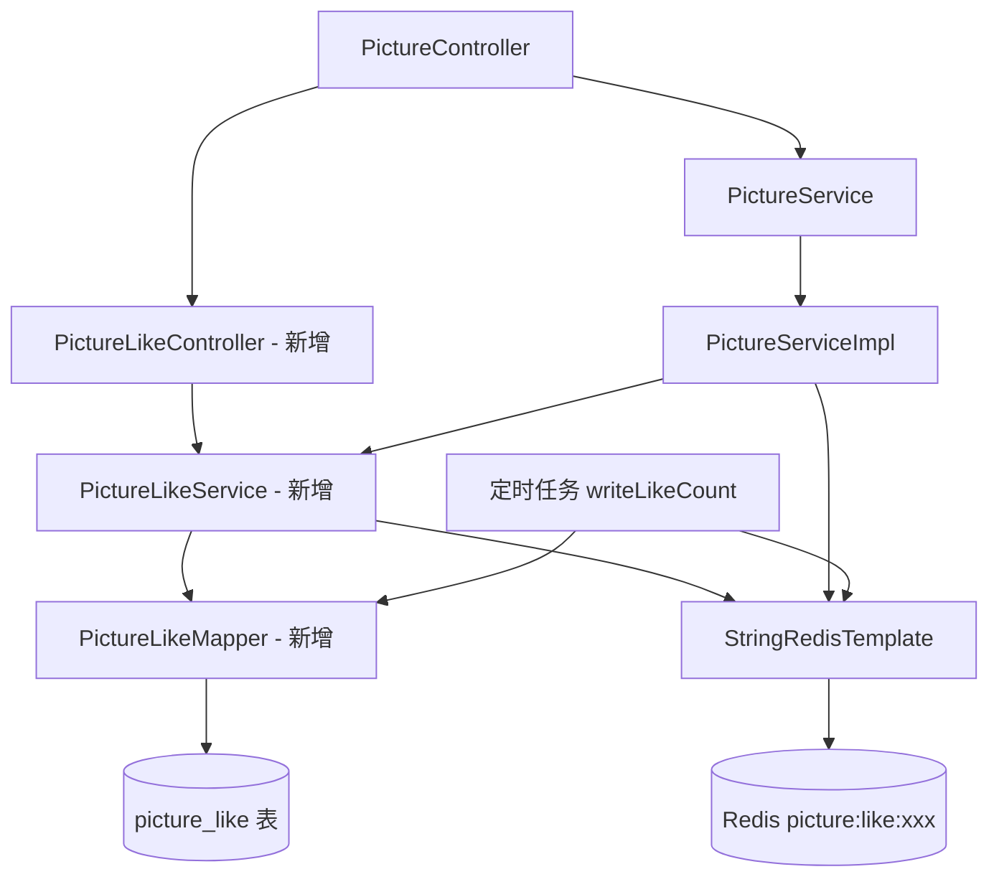

## 用户需求

用户希望为图片平台添加**点赞功能**，允许登录用户对图片进行点赞或取消点赞操作。

## 产品概述

在现有图片平台基础上，新增图片点赞模块。用户可以在查看图片时点击点赞按钮，系统记录点赞状态并实时展示图片的点赞总数。点赞为用户维度的操作，每个用户对每张图片只能点赞一次，支持取消点赞。

## 核心功能

- **点赞/取消点赞**：登录用户可对图片执行点赞或取消点赞操作，接口幂等处理（已赞则取消，未赞则点赞）
- **点赞状态查询**：在图片详情/列表返回时，附带当前用户对该图片的点赞状态（是否已赞）
- **点赞数展示**：图片 VO 中携带 `likeCount`（总点赞数），采用 Redis 缓存计数 + 定时写库的方案，与现有 `viewCount` 模式一致
- **点赞关系持久化**：新建 `picture_like` 关联表，记录用户与图片的点赞关系，作为用户点赞状态查询的数据源

## 技术栈

与现有项目完全一致：

- **框架**：Spring Boot + MyBatis-Plus
- **缓存**：Redis（StringRedisTemplate）+ Caffeine 本地缓存
- **数据库**：MySQL（通过 ALTER TABLE 追加字段，与现有 SQL 文件风格保持一致）
- **工具**：Hutool、Lombok、Gson

---

## 实现方案

### 核心设计思路

点赞功能分为两个维度：

1. **点赞关系**：新建 `picture_like` 表，记录 `(userId, pictureId)` 唯一关系，用于判断用户是否已点赞，是真实数据源。
2. **点赞计数**：在 `picture` 表新增 `likeCount` 字段，作为冷数据备份；Redis Key `picture:like:{pictureId}` 作为热计数器（与 `viewCount` 的 `picture:view:{pictureId}` 模式完全对齐），由定时任务每天凌晨4点批量写库。

### 点赞/取消点赞流程

```
用户点赞请求
  → 查询 picture_like 表判断是否已赞
  → 已赞：删除记录 + Redis DECR
  → 未赞：插入记录 + Redis INCR
  → 返回当前点赞状态（true=已赞/false=未赞）
```

### 点赞数展示

- PictureVO 新增 `likeCount`（从 Redis 实时读取，fallback 到数据库字段）
- PictureVO 新增 `isLiked`（当前登录用户是否已赞，查询 `picture_like` 表）

### 性能考量

- `picture_like` 表建立 `UNIQUE KEY (userId, pictureId)`，防止重复点赞，查询 O(1)
- Redis INCR/DECR 原子操作，无并发安全问题
- 列表接口查询点赞状态时，批量查询当前用户对当页图片的点赞状态，避免 N+1 问题
- 定时任务写库沿用已有 `writeViewCount` 模式，新增 `writeLikeCount` 方法

---

## 实现细节

1. **mybatis-plus 配置**：项目中 `map-underscore-to-camel-case: false`，实体字段名需与数据库列名完全一致（如 `likeCount` 对应列名 `likeCount`）
2. **缓存一致性**：点赞操作直接操作 Redis 计数器，不直接更新 MySQL `likeCount`（由定时任务批量同步），与 viewCount 模式一致
3. **图片删除时**：需同步清理 Redis 点赞计数 key（在 `deletePicture` 方法中补充）
4. **未登录用户**：列表/详情接口 `isLiked` 返回 `false`，不影响点赞数展示

---

## 架构设计



---

## 目录结构

```
src/main/java/com/axin/picturebackend/
├── controller/
│   └── PictureLikeController.java        # [NEW] 点赞控制器。提供 POST /picture/like 接口（点赞/取消点赞），需要登录态，接收 pictureId，返回 Boolean（true=点赞成功/false=取消点赞）
│
├── model/
│   ├── entity/
│   │   └── PictureLike.java              # [NEW] 点赞关联实体，字段：id、userId、pictureId、createTime，对应 picture_like 表
│   ├── dto/
│   │   └── picture/
│   │       └── PictureLikeRequest.java   # [NEW] 点赞请求DTO，字段：pictureId（Long）
│   └── vo/
│       └── PictureVO.java                # [MODIFY] 新增 likeCount（Long，点赞总数）和 isLiked（Boolean，当前用户是否已赞）字段
│
├── mapper/
│   └── PictureLikeMapper.java            # [NEW] MyBatis-Plus Mapper接口，extends BaseMapper<PictureLike>，需自定义批量查询某用户对图片列表的点赞状态方法
│
├── service/
│   ├── PictureLikeService.java           # [NEW] 点赞Service接口，定义 doLike(Long pictureId, User loginUser)、isLiked(Long pictureId, Long userId)、batchIsLiked(List<Long> pictureIds, Long userId) 方法
│   └── impl/
│       └── PictureLikeServiceImpl.java   # [NEW] 点赞Service实现，实现点赞/取消点赞逻辑、Redis计数操作、定时写库任务 writeLikeCount（@Scheduled cron="0 0 4 * * ?"）
│
├── constant/
│   └── RedisConstant.java                # [MODIFY] 新增 PICTURE_LIKE_COUNT = "picture:like:" 常量
│
├── model/entity/
│   └── Picture.java                      # [MODIFY] 新增 likeCount（Long）字段
│
└── service/impl/
    ├── PictureServiceImpl.java           # [MODIFY] getPictureVO、getPagePictureVO 方法中注入 PictureLikeService，填充 isLiked 和 likeCount；deletePicture 中清理 Redis 点赞key
    └── PictureService.java               # 无需修改

SQL/
└── create_tables.sql                     # [MODIFY] 新增 picture_like 表建表语句；ALTER TABLE picture ADD COLUMN likeCount

src/main/resources/
└── mapper/
    └── PictureLikeMapper.xml             # [NEW] MyBatis XML映射，定义批量查询用户对图片点赞状态的 SQL
```