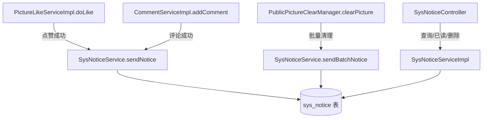

## 用户需求

为图片后端系统实现完整的消息通知功能，让用户能够及时收到系统或其他用户触发的通知消息。

## 产品概述

基于已有的 `sys_notice` 表和骨架代码，扩展实现一套完整的通知模块。通知来源包括用户行为触发（如点赞、评论）和系统定时任务触发（如冷门图片清理）。用户可查询自己的通知列表、标记已读、删除通知。

## 核心功能

- **通知发送**：提供统一的通知发送入口方法，支持单用户通知和系统广播（userId=0）；在点赞、评论、图片清理等场景自动触发发送
- **通知查询**：用户分页查询自己的通知列表，支持按未读/全部过滤，返回脱敏后的 VO 数据
- **标记已读**：支持单条标记已读和一键全部已读，更新 isRead 状态和 readTime
- **删除通知**：用户删除自己的通知（软删除），管理员可删除任意通知
- **未读数量**：查询当前用户的未读通知数量

## 技术栈

与现有项目保持完全一致：

- Spring Boot 2.7.6 + Java 1.8
- MyBatis Plus 3.5.9（分页、动态查询、软删除手动处理）
- MySQL（`sys_notice` 表已存在）
- Sa-Token + `@RoleCheck` 权限体系
- Lombok / Hutool / 雪花算法

---

## 实现思路

### 整体策略

复用现有 `sys_notice` 表和骨架代码（SysNoticeService / SysNoticeServiceImpl / SysNoticeMapper），填充完整业务逻辑，并在三个触发点（点赞、评论、图片清理）中注入 `SysNoticeService` 调用统一的发送方法。

### 关键技术决策

1. **软删除手动处理**：`SysNotice.isDeleted` 字段不符合 MyBatis Plus 默认的 `is_delete` 命名，无法直接用 `@TableLogic`。所有查询、删除统一在 `QueryWrapper` 中手动追加 `eq("isDeleted", 0)` 条件，保持一致性。
2. **同步发送，无 MQ**：通知发送在业务方法内同步调用，利用 `@Lazy` 解决循环依赖，避免引入新的中间件。
3. **广播通知查询**：查询时返回 `userId = loginUser.id OR userId = 0`（全体广播）的通知，保证系统公告可达每个用户。
4. **通知类型枚举**：新增 `NoticeTypeEnum` 枚举标识通知类型（LIKE/COMMENT/SYSTEM_CLEAR/SYSTEM），通过 `title` 字段携带类型语义，避免修改表结构。
5. **触发点无侵入**：三个触发点（doLike / addComment / clearPicture）只在成功路径末尾追加一行发送通知调用，不改变原有逻辑分支。

### 性能与可靠性

- 通知发送失败不影响主业务（try-catch 捕获异常仅打 warn 日志）
- 图片清理为批量场景（可能数百条），采用 `saveBatch()` 批量插入通知，避免逐条 insert
- 分页查询加 `idx_user_read_time(userId, isRead)` 索引（表中已存在），查询高效

---

## 架构设计



---

## 目录结构

```
src/main/java/com/axin/picturebackend/
├── model/
│   ├── entity/
│   │   └── SysNotice.java                          # [已有] 无需修改
│   ├── dto/
│   │   └── notice/
│   │       ├── NoticeQueryRequest.java             # [NEW] 查询通知请求 DTO，继承 PageRequest，含 isRead 过滤字段
│   │       └── NoticeReadRequest.java              # [NEW] 标记已读请求 DTO，含 id（单条）和 readAll（一键全读）字段
│   └── vo/
│       └── NoticeVO.java                           # [NEW] 通知响应 VO，含 id/title/content/relatedId/isRead/readTime/createTime 字段，脱敏输出
├── model/Enum/
│   └── NoticeTypeEnum.java                         # [NEW] 通知类型枚举，含 LIKE（点赞）/COMMENT（评论）/SYSTEM_CLEAR（系统清理）/SYSTEM（系统公告），每种类型携带默认 title 模板
├── mapper/
│   └── SysNoticeMapper.java                        # [MODIFY] 扩展批量查询未读数自定义方法（如需要）
├── service/
│   ├── SysNoticeService.java                       # [MODIFY] 填充业务接口：sendNotice/sendBatchNotice/listNotice/markRead/markAllRead/deleteNotice/countUnread
│   └── impl/
│       └── SysNoticeServiceImpl.java               # [MODIFY] 实现所有业务方法：软删除手动处理、广播查询（userId=0 OR userId=loginId）、批量发送
├── controller/
│   └── SysNoticeController.java                    # [NEW] 通知控制器，路径 /notice，提供查询列表、标记已读、全部已读、删除、未读数量 5 个接口
├── service/impl/
│   ├── PictureLikeServiceImpl.java                 # [MODIFY] doLike 点赞成功后注入 SysNoticeService，发送「XXX 点赞了你的图片」通知给图片作者（自己给自己点赞不通知）
│   └── CommentServiceImpl.java                     # [MODIFY] addComment 评论成功后发送「XXX 评论了你的图片」通知给图片作者（自己评论自己不通知）
└── manager/pictureClear/
    └── PublicPictureClearManager.java              # [MODIFY] clearPicture 方法清理完成后，对清理图片的上传者批量发送「图片被系统清除」通知
```